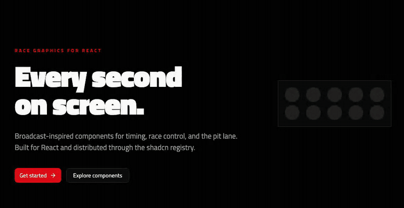
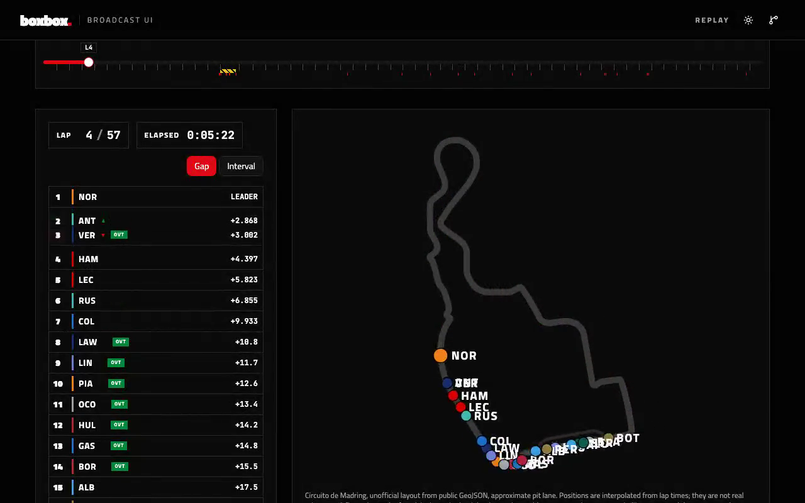

<div align="center">

# boxbox.

**Race graphics for React.**

Animated components styled after motorsport television graphics: timing towers, sector times,
start lights, track maps, team radio. Distributed as a [shadcn](https://ui.shadcn.com) registry,
so you install the source into your project and own it.

[Website](https://react-boxbox.vercel.app) ·
[Components](https://react-boxbox.vercel.app/components) ·
[Replay](https://react-boxbox.vercel.app/replay) ·
[Installation](https://react-boxbox.vercel.app/docs/installation)


<br />

<a href="https://react-boxbox.vercel.app">
  
</a>

</div>

## Demo

The [Replay](https://react-boxbox.vercel.app/replay) page plays a real race with the whole
library at once: lap counter, race clock, timing tower, track map, flag banners, speed trap,
stints, gap chart, and podium.

<a href="docs/media/demo-replay.mp4">
  
</a>

<sub>Click the image to open the video file (27 s, MP4).</sub>

## Components

17 components in four groups. Each one has a playground and its source on the
[site](https://react-boxbox.vercel.app/components).

### Timing

| Component          | Registry item                | What it is                                                                                            |
| ------------------ | ---------------------------- | ----------------------------------------------------------------------------------------------------- |
| Timing Tower       | `@boxbox/timing-tower`       | The running order. Rows slide as positions change; the value column shows gap, interval, or last lap. |
| Sector Times       | `@boxbox/sector-times`       | Three sector bars with broadcast colour coding, optional mini sectors, and a counting lap time.       |
| Overtake Indicator | `@boxbox/overtake-indicator` | The overtaking aid badge: DRS (2011–2025) or Overtake Mode (2026 rules).                              |
| Gap Chart          | `@boxbox/gap-chart`          | Gap to the leader across the race. The followed car is in colour over the field. Uses Recharts.       |

### Broadcast

| Component         | Registry item               | What it is                                                                                  |
| ----------------- | --------------------------- | ------------------------------------------------------------------------------------------- |
| Driver Name Plate | `@boxbox/driver-name-plate` | A lower third that wipes in with position, team colour, name, car number, and race status.  |
| Replay Bumper     | `@boxbox/replay-bumper`     | A transition that sweeps over a panel so its content can change behind it.                  |
| Podium            | `@boxbox/podium`            | Three steps laid out second, first, third. The steps rise last place first.                 |
| Speed Trap        | `@boxbox/speed-trap`        | One car's speed trap reading, the session best under it, and a flash for a new record.      |
| Gauge             | `@boxbox/gauge`             | Revolutions as an arc round the current gear. It turns red past the redline.                |
| Team Radio        | `@boxbox/team-radio`        | A pit wall message: who talks to whom, a live audio trace, and the transcript word by word. |

### Race Control

| Component    | Registry item          | What it is                                                                                |
| ------------ | ---------------------- | ----------------------------------------------------------------------------------------- |
| Start Lights | `@boxbox/start-lights` | A five-column gantry that arms light by light, holds, then goes out, or flashes on abort. |
| Flag Banner  | `@boxbox/flag-banner`  | A full-width banner with the track status, the sector it applies to, and a message.       |
| Lap Counter  | `@boxbox/lap-counter`  | Rolls to the next lap and calls the last lap the final lap.                               |
| Race Clock   | `@boxbox/race-clock`   | Time remaining or elapsed as H:MM:SS, driven by its parent.                               |
| Track Map    | `@boxbox/track-map`    | A circuit outline. Each sector shows the flag in force; one marker per car goes round.    |

### Pit Lane

| Component  | Registry item        | What it is                                                                          |
| ---------- | -------------------- | ----------------------------------------------------------------------------------- |
| Tyre Badge | `@boxbox/tyre-badge` | The compound and the laps on the current set. It rotates when the compound changes. |
| Stint Bar  | `@boxbox/stint-bar`  | A car's tyre strategy as one bar: one segment per stint, filled to the current lap. |

Shared items that the components pull in for you: `boxbox-types`, `boxbox-theme`,
`boxbox-motion`, `rolling-number`, `waveform`, and the optional `boxbox-fonts`.

## Install

You need React 19, Tailwind CSS v4, and an initialized shadcn project.

Register the namespace once. Without it, `add @boxbox/...` fails, because the components
depend on each other by namespaced name:

```bash
bunx shadcn@latest registry add @boxbox=https://react-boxbox.vercel.app/r/{name}.json
```

Install the theme, then any component:

```bash
bunx shadcn@latest add @boxbox/boxbox-theme
bunx shadcn@latest add @boxbox/timing-tower
```

The theme adds the colour tokens for sectors, tyres, flags, and track status. Add the `dark`
class to `<html>` for the dark palette. Light mode is supported.

Components read `--font-display` and `--font-mono` and never import fonts themselves. For the
intended typography (Titillium Web and JetBrains Mono):

```bash
bunx shadcn@latest add @boxbox/boxbox-fonts
```

Animation uses [`motion`](https://motion.dev). Wrap your app once so movement follows the
visitor's system setting. Colour and opacity changes stay on, and every state stays readable:

```tsx
import { MotionConfig } from 'motion/react';

export function App({ children }: { children: React.ReactNode }) {
  return <MotionConfig reducedMotion="user">{children}</MotionConfig>;
}
```

## Data, and what this is not

This project is not affiliated with, endorsed by, or connected to any racing series, team,
circuit, or governing body. No official typeface, livery, logo, or team identity is reproduced.
The visual language is that of sports television in general.

The components ship no data. You pass in your own.

- **Component demos and tests** use invented drivers, teams, colours, and lap times.
- **The Replay page** plays a small, curated set of real races. Race results, lap times, and
  pit stops come from [jolpica-f1](https://github.com/jolpica/jolpica-f1). Tyre stints, sector
  times, speed trap readings, and race control come from [OpenF1](https://openf1.org), for
  races from 2023 on. Circuit outlines come from
  [bacinger/f1-circuits](https://github.com/bacinger/f1-circuits) (MIT). Team colours are
  approximations chosen by this project. The data is fetched at build time into static JSON.

## Local development

```bash
bun install
bun run dev
```

Useful scripts:

| Script                            | What it does                                                  |
| --------------------------------- | ------------------------------------------------------------- |
| `bun run typecheck`               | `tsc --noEmit`                                                |
| `bun run lint`                    | oxlint, with the react and jsx-a11y plugins                   |
| `bun run format` / `format:check` | oxfmt                                                         |
| `bun run test`                    | Vitest and Testing Library (not `bun test`, Bun's own runner) |
| `bun run registry:build`          | Generates `public/r/` from `registry.json`                    |
| `bun run og:build`                | Generates the Open Graph images in `public/og/`               |
| `bun run replays:build`           | Fetches the curated races for the Replay page                 |
| `bun run circuits:build`          | Generates `src/data/circuits.ts` from the circuit GeoJSON     |
| `bun run build`                   | Production build into `.output/`                              |

The site is built with TanStack Start, React 19, and Tailwind CSS v4, and is hosted on Vercel.
Components live in `registry/boxbox/`, the site in `src/`, and architecture decisions in
`docs/adr/`. See [CONTRIBUTING.md](CONTRIBUTING.md) for the conventions that keep a component
installable.

## License

MIT with the [Commons Clause](https://commonsclause.com): free to use, modify, and ship inside
your own products. You may not sell the components themselves as a product or service. See
[LICENSE](LICENSE).
